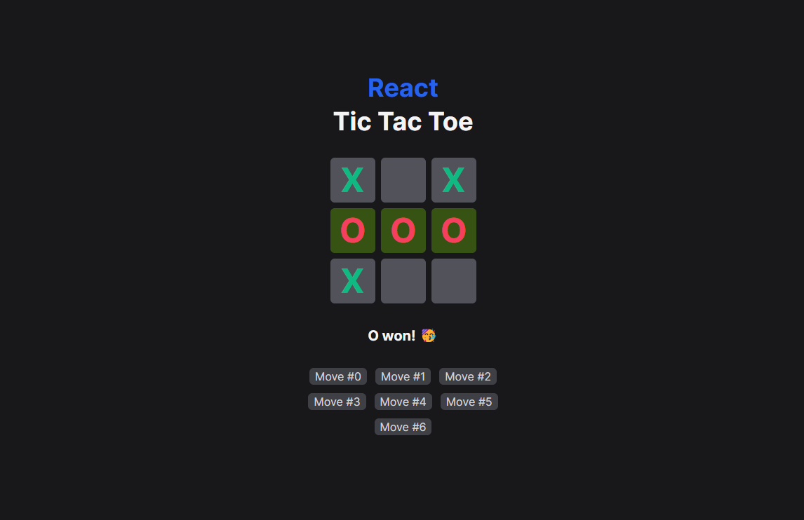

# React Tic Tac Toe



## Description

**Objective:** Create an interactive tic-tac-toe game with React.

**Why it was created:** This project was developed as a way to learn and practice React, a JavaScript library for building user interfaces.

## Technologies
This project was built using the following technologies:

- **React:** JavaScript library for building user interfaces.
- **Tailwind CSS:** Utility-first CSS framework for rapid and efficient styling.
- **TypeScript:** Superset of JavaScript that adds static typing to the code.
- **Vite:** Extremely fast build tool for front-end projects.

## Installation Instructions

### Prerequisites
Before you begin, make sure you have the following tools installed in your environment:

- Node.js (version 14 or higher)
- npm or yarn (package manager)

### Steps

1. **Clone the repository:**
    ```bash
    git clone https://github.com/lugomio/react-tic-tac-toe.git
    ```

2. **Navigate to the project directory:**
    ```bash
    cd react-tic-tac-toe
    ```

3. **Install the dependencies:**
    ```bash
    npm install
    ```

4. **Start the development server:**
    ```bash
    npm run dev
    ```

5. **Open your browser and go to:**
    ```plaintext
    http://localhost:3000
    ```

## How to Use
After following the installation steps, you can access the application in your browser. The interactive tic-tac-toe game allows two players to take turns clicking on the board cells. The first player to align three marks (horizontally, vertically, or diagonally) wins the game.

## License
This project is licensed under the [MIT License](LICENSE.md).